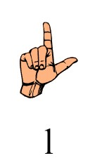
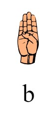
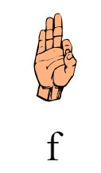
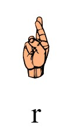

<p align="center">
  
  
</p>

# Sign Sign Revolution

Sign Sign Revolution is a Python application which turns American Sign Language (ASL) signs into keyboard input. For this project specifically, we mapped ASL signs into arrow controls for the popular rhythm game, "Dance Dance Revolution" (also known as "In the Groove").

However, our program is not limited to recognizing ASL and it is not limited to playing DDR -- anyone can effortlessly train their own models to recognize custom gestures and map them to custom functions!

This project was created by Group 46 of UIUC's CS 196 Fall 2021 course.

## Installation

Make sure you are in the `./Project/` directory of the repository for the following steps.

First, install the prerequisite packages:

```
pip install -r requirements.txt
```

Next, download and install [StepMania 5](https://www.stepmania.com/download/) for your platform. Then, navigate to your StepMania data folder (directory names may vary):

Windows: `%APPDATA%/StepMania 5/`
Linux: `~/.stepmania-5.1/`
macOS: `~/Library/Preferences/StepMania 5.1/`

Copy the contents of the `Songs` directory in this repository to `Songs` in the StepMania data directory. The two songs, "24K Magic (PrototypeRaptor Remix)" and "Bad Apple (Nhato Remix)" have been modified so that their level 1 difficulties do not contain chords, which are currently not supported by SSR. If you wish to find more song packs, check out [stepmaniaonline.net](https://search.stepmaniaonline.net/). Once you have installed songs, launch StepMania.

Finally, launch Step Step Revolution by running:

```
python ssr.py
```

You should see a window popup with input from your webcam. If you hold your hand up, you'll be able to see points plotted on your hand, as well as the sign prediction! This window will remain on top at all times, so rearrange your desktop so that SSR does not block StepMania.

## Gameplay

Ensure that the active window selected is StepMania and not SSR, otherwise, keyboard input will not be sent to StepMania.

When you see an arrow on the screen, hold up the corresponding sign. Once the arrow reaches the bar, press the spacebar to send the corresponding input.

**Default mappings (LBFR model):**

| Left (L) | Backwards (B) | Forwards (F) | Right (R) |
|:--------:|:-------------:|:------------:|:---------:|
|         |              |             |          |
|         |              |             |          |

The repository also includes directional hand sign mappings (arrows model). And of course, you can train your own model to use custom signs!

## Training your own model

We created a GUI to make it extremely easy to train your own model for use with SSR. Start by running:

```
python training_gui.py
```

In the first tab, you will be able to collect data for each label you want to identify and save them into a CSV file.

In the second tab, you will be able to train 4 different models using your generated CSV file and pick the most accurate one (we recommend using logistic regression "lr" if there is a tie).

In the third tab, you can test your model in real time to see if predictions are accurate. If you need to, you can go back and add more data points to your CSV file and retrain the models. Once you are satisfied, you can modify `ssr.py` to use your custom model file and custom `displayDefinition` labels.

## Credits

- [OpenCV](https://github.com/opencv/opencv) - used for computer vision and camera input
- [MediaPipe](https://github.com/google/mediapipe) - used for hand tracking and plotting
- [scikit-learn](https://github.com/scikit-learn/scikit-learn) - used for machine learning and training models from datasets
- [pynput](https://github.com/moses-palmer/pynput) - used to capture and send keyboard input
- [NumPy](https://github.com/numpy/numpy) - used for quick maths
- [StepMania](https://github.com/stepmania/stepmania) - used for funky fresh beats